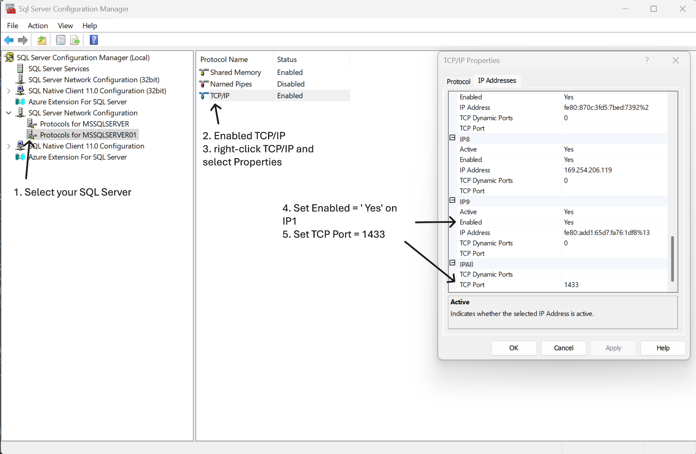
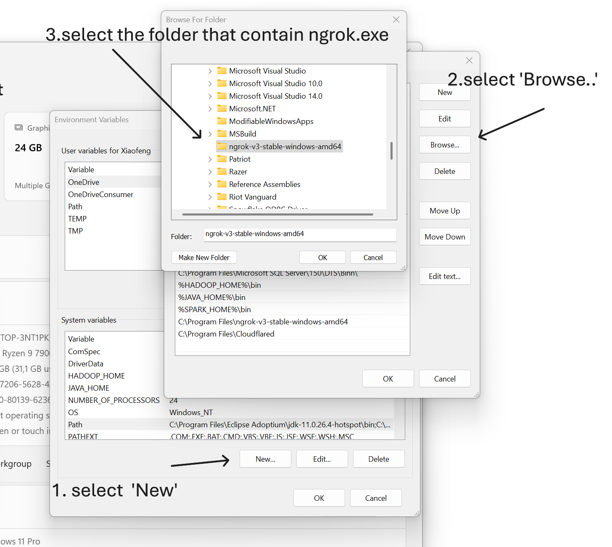
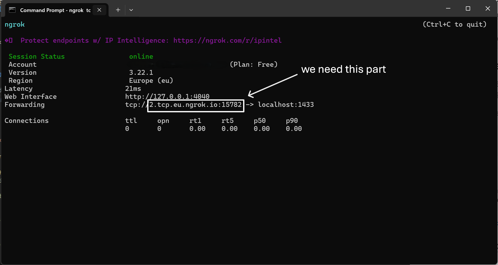

# A Complete Guide to Accessing Local SQL Server from Colab Using ngrok
---
## 1. Project Overview

This project aims to use [ngrok](https://ngrok.com/) to create a secure public tunnel that enables Google Colab to connect and interact with a locally hosted SQL Server database.

Many data analysis or machine learning tasks rely on databases deployed locally. However, Colab, as a convenient online development platform, cannot access local services by default. With ngrok, we can map the local SQL Server to a publicly accessible address to achieve the following goals:

- ✅ Remotely read data from a local SQL Server in Colab  
- ✅ Use tools like Pandas / PySpark for data transformation and processing  
- ✅ Write the processed results back to the SQL Server database

This method is suitable for scenarios such as teaching demonstrations, model development, and remote collaboration. It has the advantage of requiring no cloud service deployment and offers simple configuration.

---
## 2. Prerequisites

Before starting this tutorial, please make sure you have the following setup and environment:

### ✅ Local Environment

- SQL Server is installed (current version used: SQL Server 2022)  
- **SQL Server TCP/IP protocol** is enabled and accessible via `localhost` or IP address  
- A valid SQL Server account (username and password) is set up, and **SQL Server Authentication** is enabled  

### ✅ ngrok Account and Configuration

- Register and log in to a [ngrok official account](https://dashboard.ngrok.com/)  
- Download and install the **ngrok client**  
- Obtain your **ngrok Authtoken** and authenticate it:
    ```bash
    ngrok config add-authtoken <your token> # run this command on CMD terminal


### ✅ Google Colab Environment
Able to access the Google Colab platform

Common database-related Python libraries such as pymssql, pandas, and pyspark are installed (installation commands will be provided later)


---
## 3. Step One: Configure SQL Server and Configuration Manager

Before using ngrok to create a tunnel, please make sure your local SQL Server is properly configured and allows remote access.

---
### 3.1 Enable TCP/IP Protocol

1. Open **SQL Server Configuration Manager**  
2. Navigate to and expand **SQL Server Network Configuration** on the left panel  
3. Ensure that the `TCP/IP` protocol status is set to `Enabled`  
4. Double-click or right-click `TCP/IP` → select "Properties" → switch to the `IP Addresses` tab  
5. Scroll down to the `IPAll` section  
6. Make sure the `TCP Port` is set to `1433` and not left empty (this is the default SQL Server port)  
7. Click OK and restart the service  

If it's not enabled, right-click `TCP/IP` → choose `Enable`, then restart the SQL Server service.

As shown in the image below:



---
### 3.2 Enable SQL Server Authentication (SQL Login)

1. Open SQL Server Management Studio (SSMS)  
2. After logging in, right-click the server name → choose `Properties`  
3. Go to the `Security` tab and check: **SQL Server and Windows Authentication mode**

---
### 3.3 Create a Login Account and Grant Database Permissions

To allow Colab to successfully access SQL Server via ngrok, you need a **SQL login-enabled account** with read and write access to the target database.

#### Steps:

1. Open **SQL Server Management Studio (SSMS)** and connect to your database instance  
2. Navigate to: `Security → Logins` on the left panel  
3. Right-click `Logins` → select `New Login...`  
4. Configure the following:  
   - **Login name**: enter your desired username (e.g., `testUser`)  
   - Choose **SQL Server authentication**  
   - Set and confirm the password  
   - Optionally uncheck `Enforce password policy` to avoid complex password requirements  

5. Go to the `User Mapping` tab:  
   - Check the database you want to connect to (e.g., `TestDB`)  
   - In the `Database role membership` section below, check:  
     - `db_datareader` (read permission)  
     - `db_datawriter` (write permission)  

6. Click “OK” to finish creation  

After successful creation, the new user will appear under `Security → Logins`, for example:

    Logins
    ├── testUser ← This is the account you just created

---
## 4. Step Two: Install and Configure ngrok

We will use ngrok to expose the local SQL Server port to the internet, allowing Google Colab to access your database via a public address.

---

### 4.1 Download and Install ngrok

You can download the version of ngrok appropriate for your operating system from the official website:

👉 [https://ngrok.com/download](https://ngrok.com/download)

After extracting the archive, add the `ngrok` executable to your system's environment variables.

#### 🔧 Setting up Environment Variables on Windows

1. Move the extracted `ngrok.exe` to a fixed directory, for example:  
   `C:\Program Files\ngrok`

2. Open the Environment Variables configuration:  
   Control Panel → System and Security → System → Advanced System Settings → Environment Variables (picture 1)

3. In the **System variables** section, find and select `Path`, then click **Edit** (picture 2)

4. Click **New**, then enter the path to your ngrok executable, for example:

    ```
    C:\Program Files\ngrok


5. Confirm and close all windows, then reopen your command line interface (CMD or PowerShell)

Reference images:
- Picture 1:  
  

- Picture 2:  
  

---

### 4.2 Set Up ngrok Authentication (First-Time Only)

Log in to the [ngrok dashboard](https://dashboard.ngrok.com/get-started/setup), copy your Authtoken, and run the following command in your terminal to authenticate:

    ngrok config add-authtoken <your-ngrok-token>


### 4.3 Start a Tunnel for SQL Server
Make sure your local SQL Server is running and listening on the default port 1433.

Although ngrok requires a credit card to enable TCP tunnels, using ngrok as shown in this tutorial will not incur any charges.

Assuming your SQL Server is using port 1433, run the following command to start a TCP tunnel:
    ngrok tcp 1433

Once started, ngrok will return a public forwarding address, for example:

    Forwarding  tcp://0.tcp.ngrok.io:12345 -> localhost:1433

Note this address (e.g., 0.tcp.ngrok.io:12345) — you will use it in Colab to connect to your database.
- picture 3：



---
## 5. Step Three: Access the Database from Colab (Using `pymssql`)

We will use the `pymssql` module to remotely connect from Google Colab to the local SQL Server. The connection will use the public address provided by ngrok.

---

### 5.1 Install `pymssql`

    !pip install pymssql


- As shown in the image below:


### 5.2 Write the Connection Code
Below is an example of how to connect to SQL Server (replace with your actual information):

    import pymssql
    import pandas as pd

    # Replace with your actual information
    conn = pymssql.connect(
        server='5.tcp.eu.ngrok.io:99999',   # ✅ ngrok public address (host:port)
        user='testUser',                    # ✅ SQL Server login username
        password='qwer1234',                # ✅ Login password
        database='ETL'                      # ✅ Database name
    )


💡Tips

- pymssql is implemented in pure Python, which makes it suitable for Colab environments.

- The server parameter can use the host:port format directly (with : as a separator).

- Your SQL Server must have SQL authentication enabled and port 1433 open.

- Keep the ngrok tunnel running to avoid connection failures.

---
## 6. Step Four: Read and Transform Data

Once successfully connected to SQL Server, we can use `pandas` to read data tables and perform analysis, cleaning, or transformation.

In this example, we will read the `customers` table from the ETL database.

---

### 6.1 Example: Query Data

Read data from the `customers` table.

    import pandas as pd

    # Query data
    df = pd.read_sql("SELECT * FROM dbo.customers", conn)

    # Display the first few rows
    print(df.head())

### 6.2 Example: Clean Data
### Add Surrogate key, Inge_date, and Inge_time

    # Current timestamp
    now = datetime.now()

    # Reassign CustomerID starting from 1
    df["CustomerID"] = range(1, len(df) + 1)

    # Add SurrogateKey (also starting from 1)
    df["SurrogateKey"] = range(1, len(df) + 1)

    # Add date and time columns
    df["Inge_date"] = now.date()
    df["Inge_time"] = now.strftime("%H:%M:%S")

    # Display full DataFrame
    pd.set_option('display.max_rows', None)       # Show all rows
    pd.set_option('display.max_columns', None)    # Show all columns
    pd.set_option('display.width', None)          # Disable auto line wrapping
    pd.set_option('display.colheader_justify', 'left')

    # Print result
    print(df)


### Convert Pandas DataFrame to PySpark DataFrame

    from os import truncate
    from pyspark.sql import SparkSession

    # Create SparkSession (if not already created)
    spark = SparkSession.builder.appName("PandasToSpark").getOrCreate()

    # Convert pandas to Spark DataFrame
    spark_df = spark.createDataFrame(df)

    # Show result
    spark_df.show()


### Set Timezone for Inge_time and Clean Other Columns

    from pyspark.sql.functions import current_timestamp, date_format, regexp_replace
    from datetime import datetime
    import pytz

    # Set current timezone (you can change it to your own, e.g., Asia/Shanghai)
    tz = pytz.timezone('Europe/Stockholm')
    now = datetime.now(tz)
    current_time = now.strftime("%H:%M:%S")

    # Method 1: Use withColumn to update Inge_time to current time
    from pyspark.sql.functions import lit

    spark_df = spark_df.withColumn("Inge_time", lit(current_time))

    # Method 2: Use regex to replace # with @ in email addresses
    spark_df = spark_df.withColumn("Email", regexp_replace("Email", "#", "@"))

    # Show result
    spark_df.show(truncate=False)

---
## 7. Step Five: Write Processed Data Back to SQL Server

After completing the data cleaning and transformation, we will convert the `Spark DataFrame` to a `Pandas DataFrame` and then use `pymssql` to write the data to a new SQL Server table called `customer_stag`.

---

### 7.1 Convert Spark DataFrame to Pandas

    # Convert PySpark DataFrame to Pandas DataFrame
    pandas_df = spark_df.toPandas()

### 7.2 Write Data to SQL Server (Create and Populate a New Table)

    import pymssql

    # Establish database connection
    conn = pymssql.connect(
        server='5.tcp.eu.ngrok.io:99999',   # Replace with your ngrok address
        user='testUser',
        password='qwer1234',
        database='ETL'
    )

    cursor = conn.cursor()

    # (Optional) If the table already exists, drop it and recreate customer_stag
    cursor.execute("""
    IF OBJECT_ID('customer_stag', 'U') IS NOT NULL
        DROP TABLE customer_stag;

    CREATE TABLE customer_stag (
        CustomerID INT,
        FirstName VARCHAR(50),
        LastName VARCHAR(50),
        Email VARCHAR(100),
        City VARCHAR(50),
        Country VARCHAR(50),
        SurrogateKey INT,
        Inge_date DATE,
        Inge_time VARCHAR(20)
    )
    """)
    conn.commit()

### 7.3 Insert Data in Batches (Row by Row)

    # Insert each row from the pandas DataFrame into the SQL Server table
    for index, row in pandas_df.iterrows():
        cursor.execute("""
            INSERT INTO customer_stag
            (CustomerID, FirstName, LastName, Email, City, Country, SurrogateKey, Inge_date, Inge_time)
            VALUES (%d, %s, %s, %s, %s, %s, %d, %s, %s)
        """, (
            row["CustomerID"], row["FirstName"], row["LastName"], row["Email"],
            row["City"], row["Country"], row["SurrogateKey"],
            str(row["Inge_date"]), row["Inge_time"]
        ))

    conn.commit()
    conn.close()

---
## 8. Common Errors and Troubleshooting

During the entire process, you may encounter some common issues. Below are typical problems and corresponding troubleshooting suggestions:

### ❌ Issue 1: Colab Cannot Connect to SQL Server (Connection Timeout)

- ✅ Check whether ngrok is still running and the window has not been closed  
- ✅ Ensure you used `ngrok tcp 1433` and have recorded the correct public address and port  
- ✅ Verify whether the firewall is blocking port 1433 (locally or on the server)  
- ✅ Confirm that SQL Server is currently "running"  

### ❌ Issue 2: Login Failed for User

- ✅ Verify that the username and password are correct (case-sensitive)  
- ✅ Ensure SQL Server authentication is enabled (see Step 3.2)  
- ✅ Check whether the user account has access to the target database  


### ❌ Issue 3: Errors When Importing or Connecting with `pymssql`

- ✅ Make sure you’ve run `!pip install pymssql` in Colab  
- ✅ Some error messages may include "login timeout expired" or "server not found" — prioritize checking the correctness of the ngrok address  


### ❌ Issue 4: Encoding Errors When Inserting Data (e.g., UTF-8)

- ✅ Check whether the data contains special characters, emojis, or null values  


### ❌ Issue 5: `pymssql` Does Not Support Certain Data Types

- ✅ Ensure that you are using SQL Server-supported field types when inserting (e.g., `VARCHAR`, `INT`, `DATE`)  
- ✅ Avoid inserting nested structures or lists as column values  


## 9. Summary and Recommendations

This tutorial walks you through the complete process:

- ✅ Deploy and configure SQL Server locally with remote access enabled  
- ✅ Use ngrok to expose the local database as a public address  
- ✅ Successfully connect to SQL Server from Google Colab and read data  
- ✅ Use Pandas and PySpark to transform and process the data  
- ✅ Write the processed results back into a new table in SQL Server  


